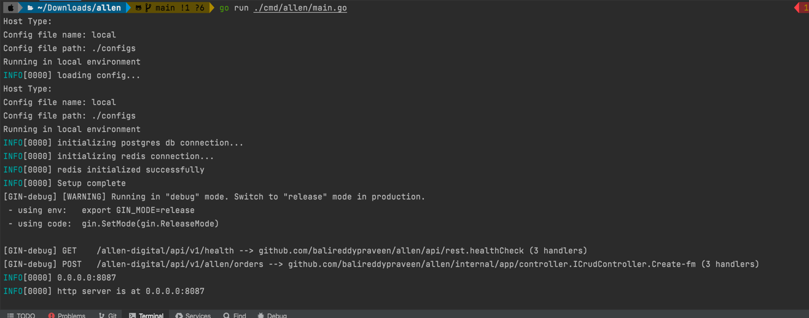

# GoLand Service

## Overview

This is a simple Go service that provides a boilerplate code for REST APIs with CRUD. It is built using the Go programming language and can be run locally or in a containerized environment.

## Prerequisites

Before you begin, ensure you have met the following requirements:

- [Go](https://golang.org/doc/install) 1.19 or higher
- [Git](https://git-scm.com/)
- Redis
- Postgres
- [Docker](https://www.docker.com/) (optional, for containerized deployment)

## Installation

To install and run the Go service, follow these steps:

1. **Clone the repository**

   ```bash
   git clone https://github.com/balireddypraveen/allen.git
2. **Navigate to the project directory**
   ```bash
   cd allen

3. Install dependencies
    ```bash
   go mod tidy && go mod vendor
4. Run Postgres (either in docker or in local) and create db 
   ```open local.yaml``` to view/update the config for database.
5. Run Redis (either in docker or in local) 
   ``open local.yaml`` to view/update the config for redis.
6. Run the service (This builds too)
    ```bash
   go run ./cmd/allen/main.go
## Usage
Once the service is running, you can access it at http://localhost:8087. You should see a response from the service indicating that it is working correctly.


